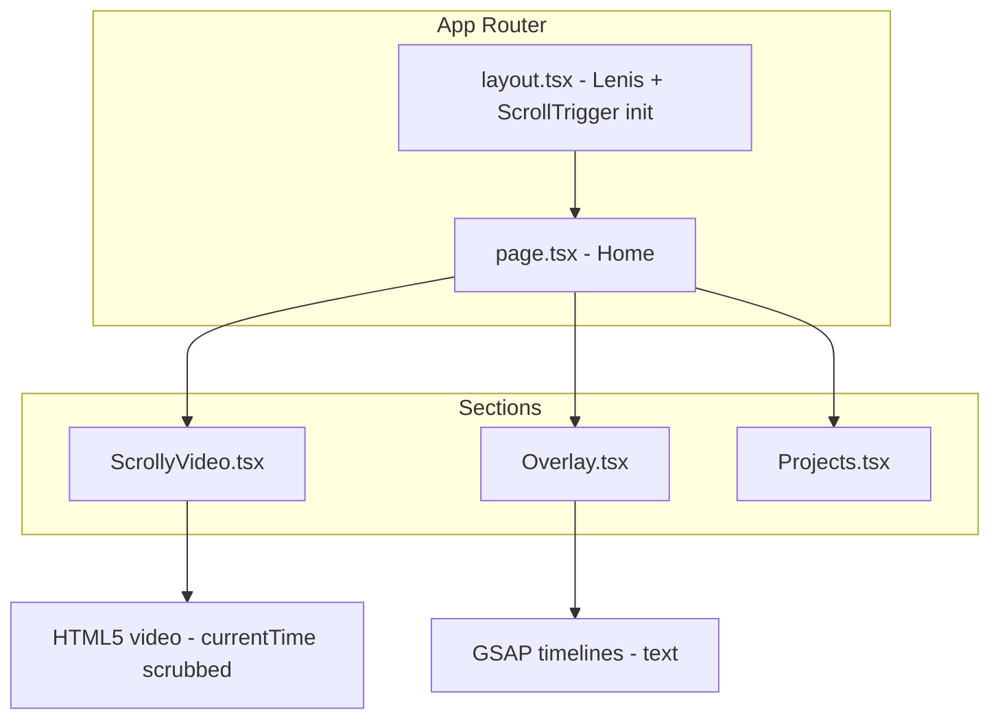

# Scrollytelling Personal Portfolio — Implementation Plan

## Current state

- Repo is effectively **greenfield**: no `package.json` or app code. `public/` exists (e.g. `michael vs bug.mp4`); you’ll use `hero.mp4` or rename/specify the exact video filename.

## Architecture overview




---

## 1. Project scaffold and dependencies

**Folder structure (target):**

```
src/
  app/
    layout.tsx
    page.tsx
    globals.css
  components/
    ScrollyVideo.tsx
    Overlay.tsx
    Projects.tsx
  lib/
    lenis-scroll.ts   (optional: Lenis + ScrollTrigger bridge)
public/
  hero.mp4            (or your final filename)
  poster.webp         (optional)
```

**Commands (Bun):**

- `bunx create-next-app@14 . --typescript --tailwind --app --src-dir --no-import-alias` (or manual init)
- Install: `gsap`, `@studio-freight/lenis` (or `lenis` per npm name)
- Optional: `nano-banana` only if you decide to use it for UI bits

**Config:**

- [tailwind.config.ts](tailwind.config.ts): extend theme (e.g. font Inter), `#121212` as primary bg.
- [src/app/layout.tsx](src/app/layout.tsx): Inter from `next/font/google`, `className` with dark bg, single root wrapper for Lenis.
- [src/app/globals.css](src/app/globals.css): `@tailwind base/components/utilities`; base `background: #121212`; smooth scroll disabled (`html { scroll-behavior: auto }`) so Lenis owns scrolling.

---

## 2. Global setup: Lenis + GSAP ScrollTrigger

**Sync pattern (canonical):**

- Lenis instance in a client layout or provider: `requestAnimationFrame` loop where `lenis.raf(time)` runs and **ScrollTrigger.update()** is called in the same frame (or right after) so ScrollTrigger always sees Lenis’ scroll position.
- Disable native scroll on `html`/body (e.g. `overflow: hidden` on html, Lenis on a scroll wrapper, or use Lenis’ default behavior with `smoothWheel: true` and no `overflow: hidden` so ScrollTrigger’s `scrollTrigger()` still reads document scroll).

**Recommended approach (simplest):**

- Use Lenis with default behavior (no wrapper): it overrides native scroll. In the same `raf` callback, call `ScrollTrigger.update()` after `lenis.raf(time)` so GSAP uses the updated scroll position.
- Register ScrollTrigger in layout (or a small client component that mounts once): `gsap.registerPlugin(ScrollTrigger)` and start the Lenis + ScrollTrigger.update loop.
- Resize: call `lenis.resize()` and `ScrollTrigger.refresh()` on window resize (debounced).
- Cleanup: `lenis.destroy()` and `ScrollTrigger.getAll().forEach(t => t.kill())` on unmount if applicable.

**Implementation location:** A client component (e.g. `SmoothScroll.tsx` or logic inside [src/app/layout.tsx](src/app/layout.tsx) wrapped in a client div) that:

1. Creates Lenis (e.g. `new Lenis({ lerp: 0.1, smoothWheel: true })`).
2. In `requestAnimationFrame`, runs `lenis.raf(time)` then `ScrollTrigger.update()`.
3. Subscribes to `window.resize` to refresh Lenis + ScrollTrigger.

---

## 3. Component 1: ScrollyVideo.tsx

**Structure:**

- **Parent:** `h-[500vh] relative` (or configurable height; 500vh gives ~5 viewports of scrub range).
- **Sticky child:** `sticky top-0 h-screen w-full overflow-hidden`.
- **Video:** Single `<video>` with `className="absolute inset-0 w-full h-full object-cover"`, `playsInline`, `muted`, `preload="auto"`, no autoplay.

**ScrollTrigger scrub logic:**

- Use a **ref** for the video and the **parent** (the tall container). No state that changes on scroll (avoid rerenders).
- After mount, wait for `video.ref.current` and `video.ref.current.duration` (use `loadedmetadata` event; if `duration` is NaN/0, retry or use a small delay and read again).
- When duration is valid:
  - `gsap.to(videoRef.current, { currentTime: duration, ease: 'none', scrollTrigger: { trigger: parentRef.current, start: 'top top', end: 'bottom bottom', scrub: true } })`.
- Call `ScrollTrigger.refresh()` after the timeline/ScrollTrigger is created (and on resize) so pinning and end positions are correct.
- **iOS/Safari:** `playsInline` and `muted` are required; do not rely on autoplay; scrubbing via `currentTime` is fine.

**Performance:**

- One video element; no state updates during scroll; refs only. Avoid reading `scrollTop` in React state.
- Optional: `will-change: transform` on sticky wrapper if needed for compositing.

**Props:** `src: string` (e.g. `/hero.mp4`), optional `poster`, optional `sectionHeight` (default `500` for 500vh).

---

## 4. Component 2: Overlay.tsx

**Structure:**

- Wrapper: `z-10 absolute inset-0 pointer-events-none` (sibling or child of the sticky video wrapper in the same section so it stays above the video). Parent must be the same sticky context (e.g. overlay lives inside the sticky div of ScrollyVideo or in a sibling that’s also sticky with same pin).
- **Recommended:** Render Overlay **inside** the sticky div of ScrollyVideo so it’s one sticky unit: sticky container holds both video and overlay.

**Scroll-driven text (GSAP):**

- Use the **same** ScrollTrigger context as the video (same trigger parent, `start`/`end`). Create a timeline with `ScrollTrigger.create({ trigger, start, end, scrub })` and add tweens to that timeline for each line.
- **0%:** Center — “My Name. Creative Developer.” (e.g. opacity 0→1→1→0, y small movement).
- **~30%:** Left — “I build digital experiences.” (fade + slight y).
- **~60%:** Right — “Bridging design and engineering.” (fade + slight y).
- Use `timeline.to(ref, { opacity: 1, y: 0, duration: 1 })` etc., with keyframes at 0, 0.3, 0.6 of the timeline so text appears at the right scroll progress. Subtle parallax: different `y` or scale per line.

**Responsive:** Tailwind breakpoints for font size and padding so text remains readable on mobile; optional scale down of motion distance on small screens.

---

## 5. Component 3: Projects.tsx

- **Placement:** Below the tall ScrollyVideo section (next section in [src/app/page.tsx](src/app/page.tsx)).
- **Layout:** Grid of 3–4 cards (e.g. `grid-cols-1 md:grid-cols-2 lg:grid-cols-3` or 2x2).
- **Style:** Glassmorphism (`backdrop-blur`, semi-transparent border/bg), dark theme, rounded corners. Hover: subtle glow (e.g. `box-shadow` or ring), lift (`translateY(-4px)` or similar), smooth transition.
- **Content:** Title, short description, optional image/link per case study. Data can be a local array of objects (no CMS in scope).
- **Optional:** Stagger animation on scroll-in (GSAP ScrollTrigger or Framer Motion); keep one library for consistency (GSAP already used).

---

## 6. Page composition and data flow

- [src/app/page.tsx](src/app/page.tsx): One section with `ScrollyVideo` (with Overlay inside the sticky area), then `Projects`. No redundant wrappers; keep the tall section as the single ScrollTrigger trigger for both video and overlay timeline.
- **Video src:** Accept env or constant for asset path; default `/hero.mp4`. If you use `michael vs bug.mp4`, pass that as `src` or rename file to `hero.mp4`.

---

## 7. Execution order (step-by-step)


| Step | Action                                                                                                                                                                     |
| ---- | -------------------------------------------------------------------------------------------------------------------------------------------------------------------------- |
| 1    | Scaffold Next.js 14 (App Router), TypeScript, Tailwind, `src/` dir; add Inter and `#121212` in layout and globals.                                                         |
| 2    | Install GSAP, ScrollTrigger, Lenis; create Lenis + ScrollTrigger.update() raf loop and resize/refresh in a client component; integrate in layout.                          |
| 3    | Implement ScrollyVideo: tall container, sticky wrapper, single video with ref; on loadedmetadata, gsap.to(currentTime) with ScrollTrigger scrub; refresh after creation.   |
| 4    | Implement Overlay: same trigger as video, GSAP timeline with scrub; three text blocks at 0%, ~30%, ~60% with fade and slight motion; place inside ScrollyVideo sticky div. |
| 5    | Implement Projects: glassmorphism grid, hover states, 3–4 placeholder case studies.                                                                                        |
| 6    | Wire page.tsx; test with real `hero.mp4` (or provided filename); verify on desktop and mobile (Lenis + pinch/scroll).                                                      |


---

## 8. Key files to create or modify

- **New:** [package.json](package.json) (via create-next-app + deps), [src/app/layout.tsx](src/app/layout.tsx), [src/app/page.tsx](src/app/page.tsx), [src/app/globals.css](src/app/globals.css), [tailwind.config.ts](tailwind.config.ts), [src/components/ScrollyVideo.tsx](src/components/ScrollyVideo.tsx), [src/components/Overlay.tsx](src/components/Overlay.tsx), [src/components/Projects.tsx](src/components/Projects.tsx), and a small Lenis+ScrollTrigger client wrapper (e.g. [src/components/SmoothScroll.tsx](src/components/SmoothScroll.tsx) or inside layout).
- **Asset:** Ensure `public/hero.mp4` exists (or use your chosen filename and pass it into ScrollyVideo).

---

## 9. Optional and edge cases

- **Nano Banana:** Add only if you introduce components that benefit from it; not required for the core scrollytelling.
- **Poster:** Use `poster="/poster.webp"` on the video for first-frame or loading state.
- **Fallback:** If `duration` is still 0 after loadedmetadata (rare), set a short timeout and read again, or use a default duration (e.g. 5s) so the ScrollTrigger still creates and can be updated later.

This plan keeps one scroll context for both video and overlay, uses a single video element with ref-based scrubbing, and keeps Lenis and ScrollTrigger in sync for a cinematic, performant scrollytelling experience.