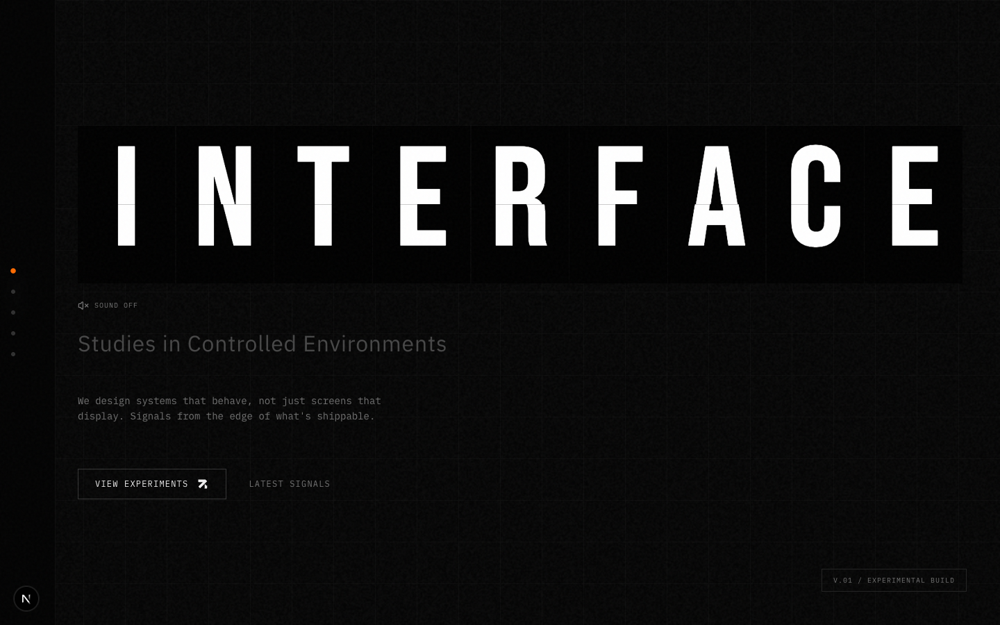
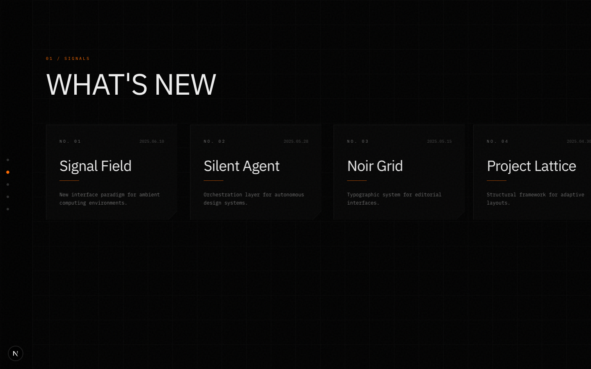
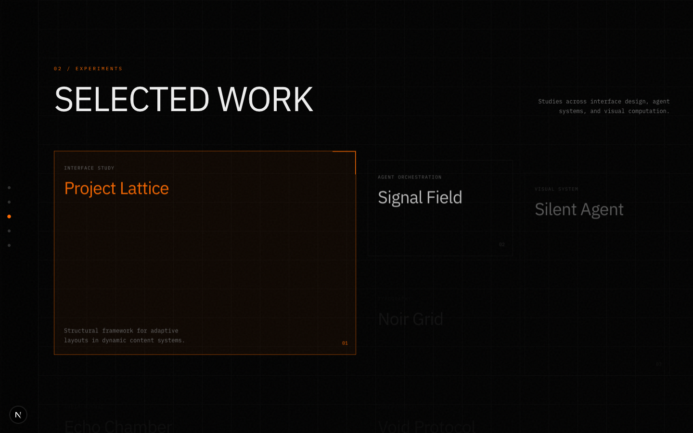
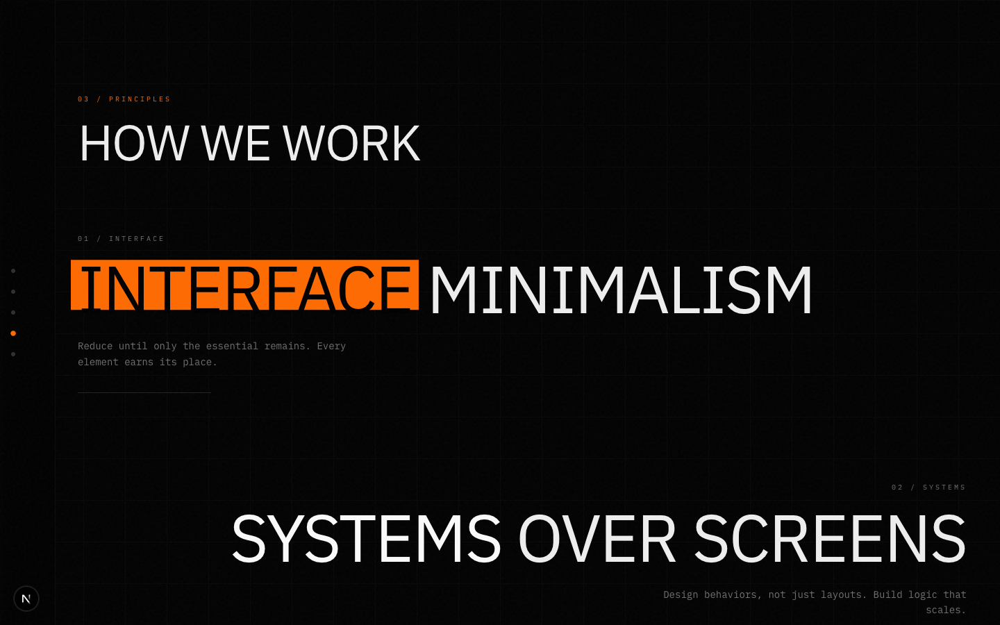
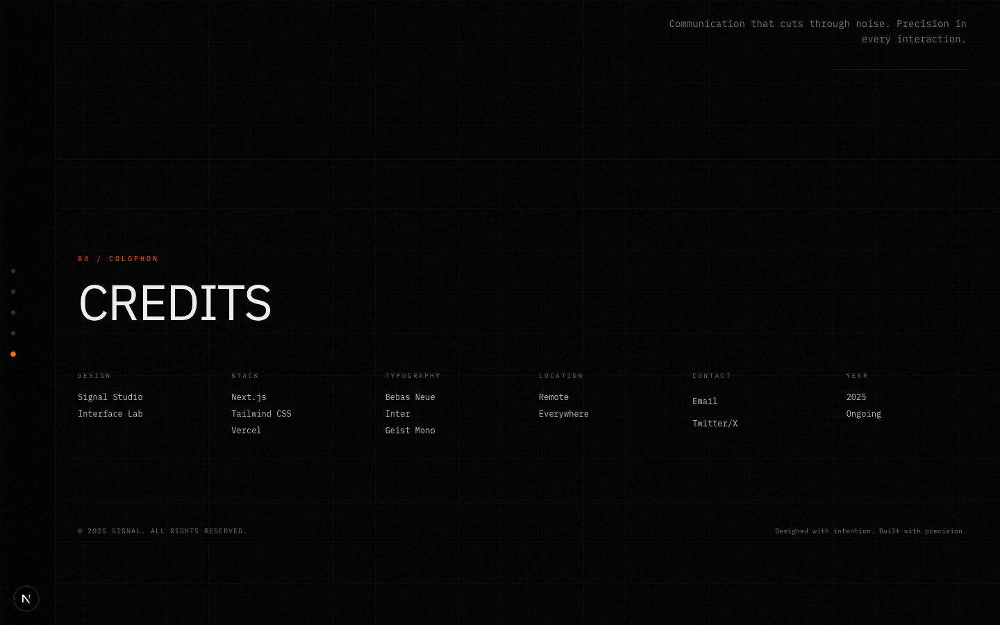
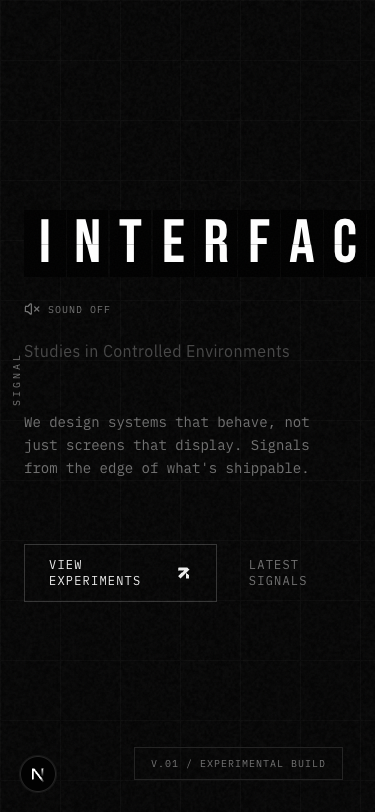

# SIGNAL — Experimental Creative Studio

> _"We design systems that behave, not just screens that display. Signals from the edge of what's shippable."_

A dark editorial portfolio built with Next.js, GSAP, and Lenis. The site is a single scrollable page divided into five sections, each revealed through scroll-triggered animations.

---

## Site Flow

### 1. Hero — `#hero`



The entry point. A full-viewport section with a split-flap mechanical display animating the word **"INTERFACE"** character by character on load, with optional audio feedback (toggled via the sound icon beneath the display).

**Key elements:**

- Split-flap animation with randomised intermediate characters and staggered timing
- Subtitle: _"Studies in Controlled Environments"_
- Body copy establishing the studio's design philosophy
- Two CTAs: **VIEW EXPERIMENTS** (→ `#work`) and **LATEST SIGNALS** (→ `#signals`)
- Version badge bottom-right: `v.01 / Experimental Build`
- Parallax fade — the hero content translates up and fades out as you scroll away

**Side navigation** (desktop only) anchors to the left edge throughout all sections — five dot indicators that reveal labelled section names on hover.

---

### 2. Signals — `#signals`



A horizontally scrollable card strip presenting the five most recent project signals/updates.

**Cards displayed (left → right):**

| #   | Title           | Date       | Description                                               |
| --- | --------------- | ---------- | --------------------------------------------------------- |
| 01  | Signal Field    | 2025.06.10 | New interface paradigm for ambient computing environments |
| 02  | Silent Agent    | 2025.05.28 | Orchestration layer for autonomous design systems         |
| 03  | Noir Grid       | 2025.05.15 | Typographic system for editorial interfaces               |
| 04  | Project Lattice | 2025.04.30 | Structural framework for adaptive layouts                 |
| 05  | Echo Chamber    | 2025.04.12 | Audio-visual synthesis in browser environments            |

**Interactions:**

- Cards slide in from the left on scroll enter, staggered 200ms apart
- Each card lifts (`-translate-y-2`) on hover
- Card title turns accent orange on hover
- Divider line under the title expands to full card width on hover
- A custom orange cursor disc tracks mouse movement within this section
- Cards are horizontally scrollable (scrollbar hidden)

---

### 3. Work — `#work`



An asymmetric 4-column grid showcasing six experiments. The grid uses mixed span sizes to create a magazine-style layout.

**Grid layout:**

| Project         | Medium              | Grid Span       | Description                                                          |
| --------------- | ------------------- | --------------- | -------------------------------------------------------------------- |
| Project Lattice | Interface Study     | 2×2 (hero card) | Structural framework for adaptive layouts in dynamic content systems |
| Signal Field    | Agent Orchestration | 1×1             | Autonomous coordination layer for multi-agent environments           |
| Silent Agent    | Visual System       | 1×2 (tall)      | Non-intrusive interface patterns for ambient computing               |
| Noir Grid       | Typography          | 1×1             | High-contrast typographic system for editorial interfaces            |
| Echo Chamber    | Audio-Visual        | 2×1 (wide)      | Generative soundscapes mapped to interface interactions              |
| Void Protocol   | Experimental        | 1×1             | Negative space as primary interaction medium                         |

**Interactions:**

- Cards fade up on scroll entry with 100ms stagger
- Hover reveals: orange border highlight, accent-coloured title, description text fades in, orange corner lines appear top-right
- **Project Lattice** (index 0) automatically enters its active/highlighted state when scrolled into view and remains permanently active

---

### 4. Principles — `#principles`



Four design principles displayed at large typographic scale with alternating left/right alignment. Each principle features a highlighted word rendered with an orange background swatch via `HighlightText`.

**Principles:**

| #   | Title                | Highlighted Word | Description                                                             |
| --- | -------------------- | ---------------- | ----------------------------------------------------------------------- |
| 01  | INTERFACE MINIMALISM | INTERFACE        | Reduce until only the essential remains. Every element earns its place. |
| 02  | SYSTEMS OVER SCREENS | SYSTEMS          | Design behaviors, not just layouts. Build logic that scales.            |
| 03  | CONTROLLED TENSION   | TENSION          | Balance between restraint and expression. Confidence without excess.    |
| 04  | SIGNAL CLARITY       | CLARITY          | Communication that cuts through noise. Precision in every interaction.  |

**Interactions:**

- Odd principles (01, 03) slide in from the left; even principles (02, 04) from the right
- The orange highlight block has a subtle parallax offset as you scroll through it
- Each principle has a decorative horizontal rule beneath its description

---

### 5. Colophon — `#colophon`



A credits/about section in a 6-column grid layout providing attribution, stack, and contact information.

**Columns:**

| Design        | Stack        | Typography    | Location   | Contact   | Year    |
| ------------- | ------------ | ------------- | ---------- | --------- | ------- |
| Signal Studio | Next.js      | Bebas Neue    | Remote     | Email     | 2025    |
| Interface Lab | Tailwind CSS | IBM Plex Sans | Everywhere | Twitter/X | Ongoing |
|               | Vercel       | IBM Plex Mono |            |           |         |

**Footer:** `© 2025 Signal. All rights reserved.` / _"Designed with intention. Built with precision."_

---

## Mobile View



On viewports below `md` (768px):

- Side navigation is hidden — no mobile nav replacement currently exists
- Hero title truncates at the right edge (clamp floor: `4rem`)
- Work grid collapses from 4 columns to 2 columns
- Principles lose their alternating alignment (all left-aligned)
- Horizontal Signals scroll remains touch-scrollable but has no scroll affordance indicators

---

## Navigation

The fixed side navigation (`SideNav`) is visible only on `md+` viewports. It tracks the active section via `IntersectionObserver` at a 30% intersection threshold and highlights the corresponding dot in accent orange.

```
● Index        → #hero
● Signals      → #signals
● Experiments  → #work
● Principles   → #principles
● Colophon     → #colophon
```

Clicking a dot calls `scrollIntoView({ behavior: 'smooth' })` to jump to that section.

---

## Tech Stack

| Layer         | Technology                                                         |
| ------------- | ------------------------------------------------------------------ |
| Framework     | Next.js 16 (App Router)                                            |
| Styling       | Tailwind CSS v4                                                    |
| Animations    | GSAP + ScrollTrigger, Framer Motion                                |
| Smooth scroll | Lenis (`duration: 1.2s`)                                           |
| Typography    | Bebas Neue (display), IBM Plex Sans (body), IBM Plex Mono (labels) |
| Deployment    | Vercel                                                             |

---

## Local Development

```bash
npm install
npm run dev
# → http://localhost:3000
```
